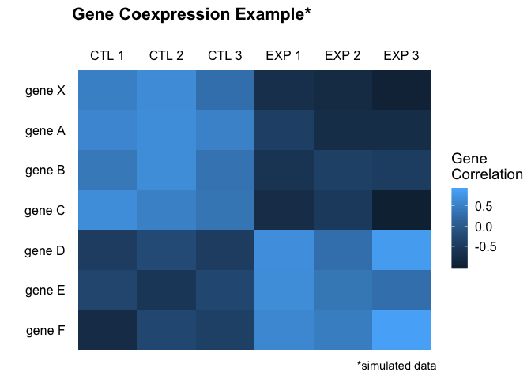
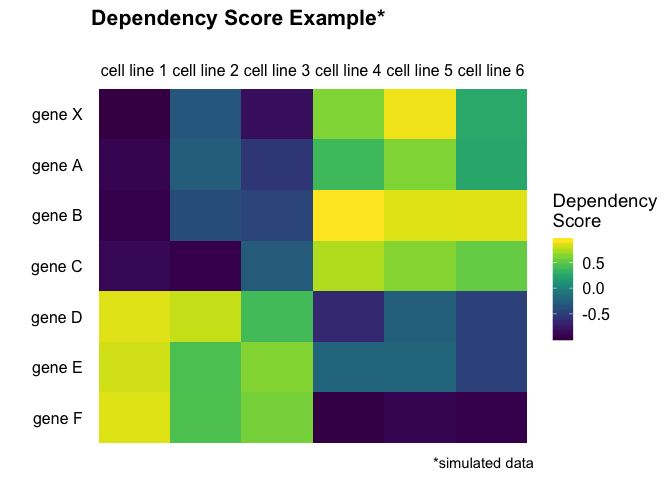
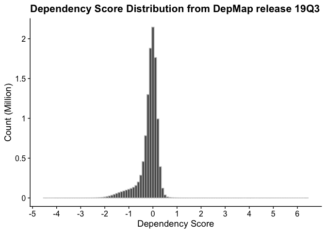
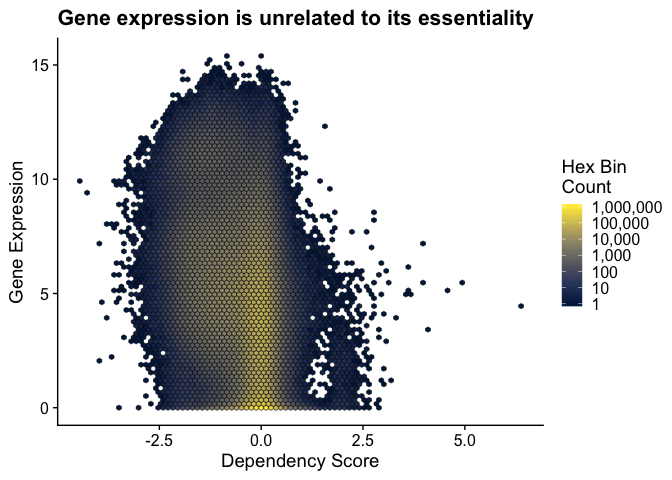
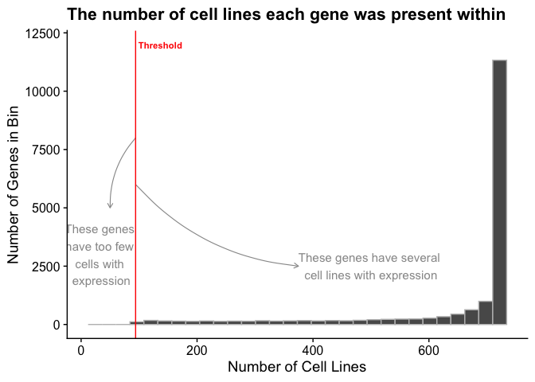
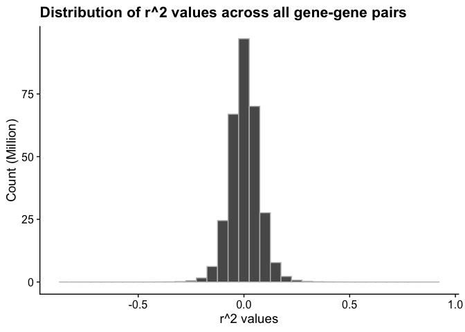
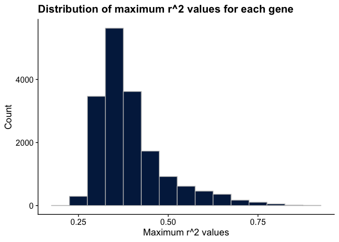

Why this project?
-----------------

Like the proverbial man [searching for his lost keys under the lamp
post](https://www.matthewhirschey.com/articles/exploratory-mind) because
the light shines there, searching for biological truths often occurs
under ‘lamp posts’ because that’s where scientists can see. But what if
your keys are not under the light? Or your gene is totally unknown? What
do you do?

The scientific method has guided scientific minds for hundreds of years,
starting with a question, followed by a hypothesis, and then an
experimental path to test the prediction. While hypotheses are the
bedrock of science, the volume, complexity, and sophistication of modern
science necessitate a new method.

Generating hypotheses is easy: take any two ideas and consider the
possiblity that they are mechanistically linked. But generating *good*
hypotheses is difficult. A good hypothesis needs a strong rationale,
supported by ample data, all of which point to a bona fide mechanistic
link. And then comes the significant time and cost to invest in testing
the idea, which might or might not be *real* or relevant.

New tools in Data Science – a combination of computer programming, math
& statistics, and topical expertise – combined with the rapid adoption
of open science and data sharing together allow scientists to access
publically available datasets and interrogate these data *before*
performing any experiments.

Imagine having strong data to support your new hypothesis *before*
testing it. Welcome to data-driven hypothesis.

What is this project?
---------------------

The overall goal of the data-driven hypothesis (DDH) project is to use
new tools in Data Science to generate hypotheses supported by data that
can be tested in the lab.

Several high-quality, functional genomic datasets are published online
and made available with Creative Commons Attribution 4.0 International
[(CC BY 4.0)](https://creativecommons.org/licenses/by/4.0/) licenses.
Functional genomics is a field of molecular biology that aims to
understand the function of all genes and proteins in a genome – a stated
goal of much basic science research. In functional genomics,
experimental strategies generally involve high-throughput, genome-wide
approaches rather than a more traditional “gene-by-gene” approach. The
advent and rapid adoption of data-sharing platforms, such as
[figshare.com](https://figshare.com) have provided high-quality data
sets for public interrogation. The DDH project aims to integrate
functional genomics data and holds tremendous promise to generate
hypotheses, data, and knowledge in order to provide a deep understanding
of the dynamic properties of an organism.

How does it work?
-----------------

This project began as an extension of a simple and common concept in
molecular biology called gene co-expression analysis. When a gene of
unknown function is identified, one strategy to learn something about
the new gene is to identify shared patterns of expression with other
genes. If unkonwn Gene X is expressed with known genes A, B, and C, then
you can infer that Gene X might be part of a functional module with A,
B, C. This approach is particularly powerful when genes A, B, and C are
part of a known biological pathway, which leads to the hypothesis that
Gene X might also be part of that same pathway.

Following on this idea, we set out to map genes to common functional
pathways based on dependence of a pathway for cell viability. Project
Achilles is a systematic effort by the [Broad
Institute](https://www.broadinstitute.org) as part of a larger [‘DepMap’
projecte](http://www.depmap.org) aimed at identifying and cataloging
gene essentiality across hundreds of genomically characterized cancer
cell lines using highly standardized pooled genome-scale
loss-of-function screens. This project uses lentiviral-based pooled RNAi
or CRISPR/Cas9 libraries to systematically knock-out each gene in the
genome, which allows for the stable suppression/ablation of each gene
individually in a subset of cells within a pooled format allowing for
genome wide interrogation of gene essentiality. Using computational
modeling, a normalized value of gene essentiality is given for each gene
in a single cell line. A lower score means that a gene is more likely to
be essential in a given cell line. A score of -1 corresponds to the
median of all common essential genes, whereas a score of 0 is equivalent
to a gene that is not essential; a positive score indicates a gain in
fitness and often identifies tumor supressor genes.

It is well-known that human cancer cell lines rely on different pathways
for their viability. Indeed this is the entire rationale for
personalized, precision medicine in cancer. The overall goal of the
‘DepMap’ project is to identify all essential genes in 2000 cell lines
over the 5-year project period to identify new therapeutic targets in
various cancers. Despite not knowing the mechanistic basis for why some
cell lines require specific genes while other cell lines do not, we
reasoned that intrinsic reliance of a cell on a pathway might allow
unbiased detection of novel genes participating in specific pathways.

What did I do?
--------------

Essential gene data from Project Achilles were downloaded from the
DepMap portal at: [depmap.org](https://depmap.org/portal/download/). The
19Q3 release contains gene essentiality scores for 18334 genes across
625 cell lines.

#### Patterns

To find patterns in gene dependencies across cell lines, we generated a
Pearson correlation matrix of all genes by all genes. This analysis
generated gene-gene correlation values that matched values published on
[depmap.org](https://depmap.org), validating the first step in our
analysis. High levels of gene expression are often thought to be
indicative of key genes for a given cell type. Thus, we next compared
dependency values to gene expression values. The [Cancer Cell Line
Encyclopedia](https://portals.broadinstitute.org/ccle/about) project is
a collaboration between the Broad Institute, and the Novartis Institutes
for Biomedical Research and its Genomics Institute of the Novartis
Research Foundation, which together conduct detailed genetic and
pharmacologic characterization of a large panel of human cancer models.
As of the CCLE 2019 release, 1210 cell lines have been characterized for
gene expression. In the 19Q3 DepMap release, 621 of the 625 cell lines
have gene expression data. Using these two datasets, we compared the
essentiality of a gene to its expression value.

We predicted a V-shaped curve, with with stronger dependencies as gene
expression increases. Surprisingly, we saw no relationship between gene
expression and gene essentiality, where genes with both low and high
expression displayed both gains and losses in fitness. The overall
observation from this dataset shows baseline gene expression levels are
poor indicators of the essentaility of a gene. This analysis also
highlighted that several genes were binned on the x-axis, i.e. could
have no measureable expression levels, but have assigned dependency
scores. Across 625 cell lines in the Achilles project, 16.4% of all gene
expression values are zero, confirming this notion.

#### Noise Reduction

Given cells do not express all genes, but might receive a dependency
sore in this experimental paradigm, we sought to remove dependency
scores for gene-cell line pairs that have an expression value of zero
under basal conditions. Of the 625 cell lines for which gene
essentiality data is collected, 621 have genome-wide gene expression
data. From these cell lines, we removed dependency scores for genes from
cell line that have a corresponding gene expression value of zero.

For some genes expressed in highly specific and restricted cell types,
this operation removed many dependency values. After removing these
values, we found that highly specilaized genes in discrete cell types
have too few cells with both gene expression values and gene
essentiality values to assign a meaningful correlation value. Thus, if a
gene was absent from too many cell lines, we omitted it to prevent
assigned values from relying on too few data points.

We set a threshold of no more than zeros, meaning that if a gene had
fewer than cell lines with dependency values, the correaltion pattern of
a gene would be meaningless, and that gene was therefore removed. This
process removed 1871 genes that had too few cells with expression and
dependency data. These ‘cleaned’ dependency data had 16463 remaining
gene-dependency pairs, which were then used to generate correlation
matrix.

How does it work?
-----------------

To identify genes that shared similar patterns of essentiality with
other genes, thereby placing genes in functional pathways, we generated
a Pearson correlation matrix on these prioritized data in order to
quantify the similarity in dependency patterns and annotate genes in
functional pathways.

This process generated approximately 336 million correlation values,
with a distribution centered around zero. This output produced a range
of maximum correlation values for each gene.

#### Statistics

Rather than setting an arbitrary threshold for the R^2 value that would
be considered a low, medium, or high correlation between two genes, we
performed a permutation test on the correlated data. A permutation test
involves permuting one or more variables in a data set before performing
the test, in order to break any existing relationships and simulate the
null hypothesis. In this case, we broke the relationshipe between
gene-gene pairs and the correlation values. We can then compare the true
statistic (mean correlation) to the generated distribution of null
statistics (fake means), along with standard deviations of these sampled
data. This strategy will give a better idea of where to draw a threshold
of a “signficiant correlation” for these analyses. We sampled 20,000 R^2
values from all gene-gene pairs without replacement simulating a virtual
Achilles dataset for a single cell. We then repeated this process 1000
times mimicking 1000 discrete cell lines.

This statistical analysis produced the following data:  
*Mean: 0.0029348  
*Standard Deviation: 0.0594495

Using a standard deviation threshold of 3, we calculated the boundaries
of R^2 values to be greater than 0.1812833 or lower than -0.1754137 for
negative correlations.

#### Pathway Analyses

To identify clusters of genes with shared relationships, we perfromed
gene set enrichment analysis. Enrichment analysis is a computational
method for inferring knowledge about a target gene set by comparing it
to annotated gene sets representing prior biological knowledge.
Enrichment analysis determines whether an input set of genes
significantly overlaps with annotated gene sets. For each gene in our
matrix, we determined the number of genes that were greater than or less
than 3 standard deviations away from the permuted mean. This target gene
list was then queried against 108 gene sets across a [broad range of
curated data](https://amp.pharm.mssm.edu/Enrichr/#stats). By leveraging
the [Enrichr](https://amp.pharm.mssm.edu/Enrichr/) resource from the
[Ma’ayan Laboratory](http://labs.icahn.mssm.edu/maayanlab/), we
determined the top ranked pathways, processes, drugs, cell lines,
tissues, or diseases, and ranked by p-value. In this setting, the
p-value is computed using a standard statistical method used by most
enrichment analysis tools: Fisher’s exact test or the hypergeometric
test. This is a binomial proportion test that assumes a binomial
distribution and independence for probability of any gene belonging to
any set. [See here for more information about how Enrichr computes its
associations](https://amp.pharm.mssm.edu/Enrichr/help#background).

What do I do?
-------------

In order to identify the functional annotation of a single gene, begin
with a query. Entering a single gene in the search box produces a series
of tables and plots that identifies a functional map of the processes
that gene *might* be involved in. In some cases, a querying gene with
known functions will identify gene with well-established connections to
the query gene; in other cases, new genes and new biological process
might be identified, suggesting there is more to discover for well-known
pathways. Querying unknown genes is especially powerful, as the
associated genes and pathways provide a starting point for an otherwise
difficult problem to prioritize experimentally.

    ## Uploading data to Enrichr... Done.
    ##   Querying Achilles_fitness_decrease... Done.
    ## Parsing results... Done.
    ## Uploading data to Enrichr... Done.
    ##   Querying Achilles_fitness_increase... Done.
    ## Parsing results... Done.
    ## Uploading data to Enrichr... Done.
    ##   Querying Aging_Perturbations_from_GEO_down... Done.
    ## Parsing results... Done.
    ## Uploading data to Enrichr... Done.
    ##   Querying Aging_Perturbations_from_GEO_up... Done.
    ## Parsing results... Done.
    ## Uploading data to Enrichr... Done.
    ##   Querying Allen_Brain_Atlas_down... Done.
    ## Parsing results... Done.
    ## Uploading data to Enrichr... Done.
    ##   Querying Allen_Brain_Atlas_up... Done.
    ## Parsing results... Done.
    ## Uploading data to Enrichr... Done.
    ##   Querying ARCHS4_Cell-lines... Done.
    ## Parsing results... Done.
    ## Uploading data to Enrichr... Done.
    ##   Querying ARCHS4_IDG_Coexp... Done.
    ## Parsing results... Done.
    ## Uploading data to Enrichr... Done.
    ##   Querying ARCHS4_Kinases_Coexp... Done.
    ## Parsing results... Done.
    ## Uploading data to Enrichr... Done.
    ##   Querying ARCHS4_TFs_Coexp... Done.
    ## Parsing results... Done.
    ## Uploading data to Enrichr... Done.
    ##   Querying ARCHS4_Tissues... Done.
    ## Parsing results... Done.
    ## Uploading data to Enrichr... Done.
    ##   Querying BioCarta_2016... Done.
    ## Parsing results... Done.
    ## Uploading data to Enrichr... Done.
    ##   Querying BioPlex_2017... Done.
    ## Parsing results... Done.
    ## Uploading data to Enrichr... Done.
    ##   Querying Cancer_Cell_Line_Encyclopedia... Done.
    ## Parsing results... Done.
    ## Uploading data to Enrichr... Done.
    ##   Querying ChEA_2016... Done.
    ## Parsing results... Done.
    ## Uploading data to Enrichr... Done.
    ##   Querying Chromosome_Location_hg19... Done.
    ## Parsing results... Done.
    ## Uploading data to Enrichr... Done.
    ##   Querying CORUM... Done.
    ## Parsing results... Done.
    ## Uploading data to Enrichr... Done.
    ##   Querying Data_Acquisition_Method_Most_Popular_Genes... Done.
    ## Parsing results... Done.
    ## Uploading data to Enrichr... Done.
    ##   Querying Disease_Perturbations_from_GEO_down... Done.
    ## Parsing results... Done.
    ## Uploading data to Enrichr... Done.
    ##   Querying Disease_Perturbations_from_GEO_up... Done.
    ## Parsing results... Done.
    ## Uploading data to Enrichr... Done.
    ##   Querying Disease_Signatures_from_GEO_up_2014... Done.
    ## Parsing results... Done.
    ## Uploading data to Enrichr... Done.
    ##   Querying Drug_Perturbations_from_GEO_down... Done.
    ## Parsing results... Done.
    ## Uploading data to Enrichr... Done.
    ##   Querying Drug_Perturbations_from_GEO_up... Done.
    ## Parsing results... Done.
    ## Uploading data to Enrichr... Done.
    ##   Querying DrugMatrix... Done.
    ## Parsing results... Done.
    ## Uploading data to Enrichr... Done.
    ##   Querying DSigDB... Done.
    ## Parsing results... Done.
    ## Uploading data to Enrichr... Done.
    ##   Querying ENCODE_and_ChEA_Consensus_TFs_from_ChIP-X... Done.
    ## Parsing results... Done.
    ## Uploading data to Enrichr... Done.
    ##   Querying ENCODE_Histone_Modifications_2015... Done.
    ## Parsing results... Done.
    ## Uploading data to Enrichr... Done.
    ##   Querying ENCODE_TF_ChIP-seq_2015... Done.
    ## Parsing results... Done.
    ## Uploading data to Enrichr... Done.
    ##   Querying Enrichr_Libraries_Most_Popular_Genes... Done.
    ## Parsing results... Done.
    ## Uploading data to Enrichr... Done.
    ##   Querying Enrichr_Submissions_TF-Gene_Coocurrence... Done.
    ## Parsing results... Done.
    ## Uploading data to Enrichr... Done.
    ##   Querying Epigenomics_Roadmap_HM_ChIP-seq... Done.
    ## Parsing results... Done.
    ## Uploading data to Enrichr... Done.
    ##   Querying ESCAPE... Done.
    ## Parsing results... Done.
    ## Uploading data to Enrichr... Done.
    ##   Querying GeneSigDB... Done.
    ## Parsing results... Done.
    ## Uploading data to Enrichr... Done.
    ##   Querying GO_Biological_Process_2018... Done.
    ## Parsing results... Done.
    ## Uploading data to Enrichr... Done.
    ##   Querying GO_Cellular_Component_2018... Done.
    ## Parsing results... Done.
    ## Uploading data to Enrichr... Done.
    ##   Querying GO_Molecular_Function_2018... Done.
    ## Parsing results... Done.
    ## Uploading data to Enrichr... Done.
    ##   Querying GTEx_Tissue_Sample_Gene_Expression_Profiles_down... Done.
    ## Parsing results... Done.
    ## Uploading data to Enrichr... Done.
    ##   Querying GTEx_Tissue_Sample_Gene_Expression_Profiles_up... Done.
    ## Parsing results... Done.
    ## Uploading data to Enrichr... Done.
    ##   Querying GWAS_Catalog_2019... Done.
    ## Parsing results... Done.
    ## Uploading data to Enrichr... Done.
    ##   Querying HMDB_Metabolites... Done.
    ## Parsing results... Done.
    ## Uploading data to Enrichr... Done.
    ##   Querying HomoloGene... Done.
    ## Parsing results... Done.
    ## Uploading data to Enrichr... Done.
    ##   Querying Human_Gene_Atlas... Done.
    ## Parsing results... Done.
    ## Uploading data to Enrichr... Done.
    ##   Querying Human_Phenotype_Ontology... Done.
    ## Parsing results... Done.
    ## Uploading data to Enrichr... Done.
    ##   Querying HumanCyc_2015... Done.
    ## Parsing results... Done.
    ## Uploading data to Enrichr... Done.
    ##   Querying HumanCyc_2016... Done.
    ## Parsing results... Done.
    ## Uploading data to Enrichr... Done.
    ##   Querying huMAP... Done.
    ## Parsing results... Done.
    ## Uploading data to Enrichr... Done.
    ##   Querying InterPro_Domains_2019... Done.
    ## Parsing results... Done.
    ## Uploading data to Enrichr... Done.
    ##   Querying Jensen_COMPARTMENTS... Done.
    ## Parsing results... Done.
    ## Uploading data to Enrichr... Done.
    ##   Querying Jensen_DISEASES... Done.
    ## Parsing results... Done.
    ## Uploading data to Enrichr... Done.
    ##   Querying Jensen_TISSUES... Done.
    ## Parsing results... Done.
    ## Uploading data to Enrichr... Done.
    ##   Querying KEA_2015... Done.
    ## Parsing results... Done.
    ## Uploading data to Enrichr... Done.
    ##   Querying KEGG_2019_Human... Done.
    ## Parsing results... Done.
    ## Uploading data to Enrichr... Done.
    ##   Querying KEGG_2019_Mouse... Done.
    ## Parsing results... Done.
    ## Uploading data to Enrichr... Done.
    ##   Querying Kinase_Perturbations_from_GEO_down... Done.
    ## Parsing results... Done.
    ## Uploading data to Enrichr... Done.
    ##   Querying Kinase_Perturbations_from_GEO_up... Done.
    ## Parsing results... Done.
    ## Uploading data to Enrichr... Done.
    ##   Querying Ligand_Perturbations_from_GEO_down... Done.
    ## Parsing results... Done.
    ## Uploading data to Enrichr... Done.
    ##   Querying Ligand_Perturbations_from_GEO_up... Done.
    ## Parsing results... Done.
    ## Uploading data to Enrichr... Done.
    ##   Querying LINCS_L1000_Chem_Pert_down... Done.
    ## Parsing results... Done.
    ## Uploading data to Enrichr... Done.
    ##   Querying LINCS_L1000_Chem_Pert_up... Done.
    ## Parsing results... Done.
    ## Uploading data to Enrichr... Done.
    ##   Querying LINCS_L1000_Kinase_Perturbations_down... Done.
    ## Parsing results... Done.
    ## Uploading data to Enrichr... Done.
    ##   Querying LINCS_L1000_Kinase_Perturbations_up... Done.
    ## Parsing results... Done.
    ## Uploading data to Enrichr... Done.
    ##   Querying LINCS_L1000_Ligand_Perturbations_down... Done.
    ## Parsing results... Done.
    ## Uploading data to Enrichr... Done.
    ##   Querying LINCS_L1000_Ligand_Perturbations_up... Done.
    ## Parsing results... Done.
    ## Uploading data to Enrichr... Done.
    ##   Querying MCF7_Perturbations_from_GEO_down... Done.
    ## Parsing results... Done.
    ## Uploading data to Enrichr... Done.
    ##   Querying MCF7_Perturbations_from_GEO_up... Done.
    ## Parsing results... Done.
    ## Uploading data to Enrichr... Done.
    ##   Querying MGI_Mammalian_Phenotype_Level_4_2019... Done.
    ## Parsing results... Done.
    ## Uploading data to Enrichr... Done.
    ##   Querying Microbe_Perturbations_from_GEO_down... Done.
    ## Parsing results... Done.
    ## Uploading data to Enrichr... Done.
    ##   Querying Microbe_Perturbations_from_GEO_up... Done.
    ## Parsing results... Done.
    ## Uploading data to Enrichr... Done.
    ##   Querying miRTarBase_2017... Done.
    ## Parsing results... Done.
    ## Uploading data to Enrichr... Done.
    ##   Querying Mouse_Gene_Atlas... Done.
    ## Parsing results... Done.
    ## Uploading data to Enrichr... Done.
    ##   Querying MSigDB_Computational... Done.
    ## Parsing results... Done.
    ## Uploading data to Enrichr... Done.
    ##   Querying MSigDB_Oncogenic_Signatures... Done.
    ## Parsing results... Done.
    ## Uploading data to Enrichr... Done.
    ##   Querying NCI-60_Cancer_Cell_Lines... Done.
    ## Parsing results... Done.
    ## Uploading data to Enrichr... Done.
    ##   Querying NURSA_Human_Endogenous_Complexome... Done.
    ## Parsing results... Done.
    ## Uploading data to Enrichr... Done.
    ##   Querying Old_CMAP_down... Done.
    ## Parsing results... Done.
    ## Uploading data to Enrichr... Done.
    ##   Querying Old_CMAP_up... Done.
    ## Parsing results... Done.
    ## Uploading data to Enrichr... Done.
    ##   Querying OMIM_Disease... Done.
    ## Parsing results... Done.
    ## Uploading data to Enrichr... Done.
    ##   Querying OMIM_Expanded... Done.
    ## Parsing results... Done.
    ## Uploading data to Enrichr... Done.
    ##   Querying Panther_2016... Done.
    ## Parsing results... Done.
    ## Uploading data to Enrichr... Done.
    ##   Querying Pfam_Domains_2019... Done.
    ## Parsing results... Done.
    ## Uploading data to Enrichr... Done.
    ##   Querying Pfam_InterPro_Domains... Done.
    ## Parsing results... Done.
    ## Uploading data to Enrichr... Done.
    ##   Querying Phosphatase_Substrates_from_DEPOD... Done.
    ## Parsing results... Done.
    ## Uploading data to Enrichr... Done.
    ##   Querying PPI_Hub_Proteins... Done.
    ## Parsing results... Done.
    ## Uploading data to Enrichr... Done.
    ##   Querying Rare_Diseases_AutoRIF_ARCHS4_Predictions... Done.
    ## Parsing results... Done.
    ## Uploading data to Enrichr... Done.
    ##   Querying Rare_Diseases_AutoRIF_Gene_Lists... Done.
    ## Parsing results... Done.
    ## Uploading data to Enrichr... Done.
    ##   Querying Rare_Diseases_GeneRIF_ARCHS4_Predictions... Done.
    ## Parsing results... Done.
    ## Uploading data to Enrichr... Done.
    ##   Querying Rare_Diseases_GeneRIF_Gene_Lists... Done.
    ## Parsing results... Done.
    ## Uploading data to Enrichr... Done.
    ##   Querying Reactome_2016... Done.
    ## Parsing results... Done.
    ## Uploading data to Enrichr... Done.
    ##   Querying RNA-Seq_Disease_Gene_and_Drug_Signatures_from_GEO... Done.
    ## Parsing results... Done.
    ## Uploading data to Enrichr... Done.
    ##   Querying SILAC_Phosphoproteomics... Done.
    ## Parsing results... Done.
    ## Uploading data to Enrichr... Done.
    ##   Querying Single_Gene_Perturbations_from_GEO_down... Done.
    ## Parsing results... Done.
    ## Uploading data to Enrichr... Done.
    ##   Querying Single_Gene_Perturbations_from_GEO_up... Done.
    ## Parsing results... Done.
    ## Uploading data to Enrichr... Done.
    ##   Querying SubCell_BarCode... Done.
    ## Parsing results... Done.
    ## Uploading data to Enrichr... Done.
    ##   Querying SysMyo_Muscle_Gene_Sets... Done.
    ## Parsing results... Done.
    ## Uploading data to Enrichr... Done.
    ##   Querying TargetScan_microRNA_2017... Done.
    ## Parsing results... Done.
    ## Uploading data to Enrichr... Done.
    ##   Querying TF_Perturbations_Followed_by_Expression... Done.
    ## Parsing results... Done.
    ## Uploading data to Enrichr... Done.
    ##   Querying TF-LOF_Expression_from_GEO... Done.
    ## Parsing results... Done.
    ## Uploading data to Enrichr... Done.
    ##   Querying Tissue_Protein_Expression_from_Human_Proteome_Map... Done.
    ## Parsing results... Done.
    ## Uploading data to Enrichr... Done.
    ##   Querying Tissue_Protein_Expression_from_ProteomicsDB... Done.
    ## Parsing results... Done.
    ## Uploading data to Enrichr... Done.
    ##   Querying Transcription_Factor_PPIs... Done.
    ## Parsing results... Done.
    ## Uploading data to Enrichr... Done.
    ##   Querying TRANSFAC_and_JASPAR_PWMs... Done.
    ## Parsing results... Done.
    ## Uploading data to Enrichr... Done.
    ##   Querying TRRUST_Transcription_Factors_2019... Done.
    ## Parsing results... Done.
    ## Uploading data to Enrichr... Done.
    ##   Querying UK_Biobank_GWAS... Done.
    ## Parsing results... Done.
    ## Uploading data to Enrichr... Done.
    ##   Querying Virus_Perturbations_from_GEO_down... Done.
    ## Parsing results... Done.
    ## Uploading data to Enrichr... Done.
    ##   Querying Virus_Perturbations_from_GEO_up... Done.
    ## Parsing results... Done.
    ## Uploading data to Enrichr... Done.
    ##   Querying VirusMINT... Done.
    ## Parsing results... Done.
    ## Uploading data to Enrichr... Done.
    ##   Querying WikiPathways_2019_Human... Done.
    ## Parsing results... Done.
    ## Uploading data to Enrichr... Done.
    ##   Querying WikiPathways_2019_Mouse... Done.
    ## Parsing results... Done.

    ## Uploading data to Enrichr... Done.
    ##   Querying Achilles_fitness_decrease... Done.
    ## Parsing results... Done.
    ## Uploading data to Enrichr... Done.
    ##   Querying Achilles_fitness_increase... Done.
    ## Parsing results... Done.
    ## Uploading data to Enrichr... Done.
    ##   Querying Aging_Perturbations_from_GEO_down... Done.
    ## Parsing results... Done.
    ## Uploading data to Enrichr... Done.
    ##   Querying Aging_Perturbations_from_GEO_up... Done.
    ## Parsing results... Done.
    ## Uploading data to Enrichr... Done.
    ##   Querying Allen_Brain_Atlas_down... Done.
    ## Parsing results... Done.
    ## Uploading data to Enrichr... Done.
    ##   Querying Allen_Brain_Atlas_up... Done.
    ## Parsing results... Done.
    ## Uploading data to Enrichr... Done.
    ##   Querying ARCHS4_Cell-lines... Done.
    ## Parsing results... Done.
    ## Uploading data to Enrichr... Done.
    ##   Querying ARCHS4_IDG_Coexp... Done.
    ## Parsing results... Done.
    ## Uploading data to Enrichr... Done.
    ##   Querying ARCHS4_Kinases_Coexp... Done.
    ## Parsing results... Done.
    ## Uploading data to Enrichr... Done.
    ##   Querying ARCHS4_TFs_Coexp... Done.
    ## Parsing results... Done.
    ## Uploading data to Enrichr... Done.
    ##   Querying ARCHS4_Tissues... Done.
    ## Parsing results... Done.
    ## Uploading data to Enrichr... Done.
    ##   Querying BioCarta_2016... Done.
    ## Parsing results... Done.
    ## Uploading data to Enrichr... Done.
    ##   Querying BioPlex_2017... Done.
    ## Parsing results... Done.
    ## Uploading data to Enrichr... Done.
    ##   Querying Cancer_Cell_Line_Encyclopedia... Done.
    ## Parsing results... Done.
    ## Uploading data to Enrichr... Done.
    ##   Querying ChEA_2016... Done.
    ## Parsing results... Done.
    ## Uploading data to Enrichr... Done.
    ##   Querying Chromosome_Location_hg19... Done.
    ## Parsing results... Done.
    ## Uploading data to Enrichr... Done.
    ##   Querying CORUM... Done.
    ## Parsing results... Done.
    ## Uploading data to Enrichr... Done.
    ##   Querying Data_Acquisition_Method_Most_Popular_Genes... Done.
    ## Parsing results... Done.
    ## Uploading data to Enrichr... Done.
    ##   Querying Disease_Perturbations_from_GEO_down... Done.
    ## Parsing results... Done.
    ## Uploading data to Enrichr... Done.
    ##   Querying Disease_Perturbations_from_GEO_up... Done.
    ## Parsing results... Done.
    ## Uploading data to Enrichr... Done.
    ##   Querying Disease_Signatures_from_GEO_up_2014... Done.
    ## Parsing results... Done.
    ## Uploading data to Enrichr... Done.
    ##   Querying Drug_Perturbations_from_GEO_down... Done.
    ## Parsing results... Done.
    ## Uploading data to Enrichr... Done.
    ##   Querying Drug_Perturbations_from_GEO_up... Done.
    ## Parsing results... Done.
    ## Uploading data to Enrichr... Done.
    ##   Querying DrugMatrix... Done.
    ## Parsing results... Done.
    ## Uploading data to Enrichr... Done.
    ##   Querying DSigDB... Done.
    ## Parsing results... Done.
    ## Uploading data to Enrichr... Done.
    ##   Querying ENCODE_and_ChEA_Consensus_TFs_from_ChIP-X... Done.
    ## Parsing results... Done.
    ## Uploading data to Enrichr... Done.
    ##   Querying ENCODE_Histone_Modifications_2015... Done.
    ## Parsing results... Done.
    ## Uploading data to Enrichr... Done.
    ##   Querying ENCODE_TF_ChIP-seq_2015... Done.
    ## Parsing results... Done.
    ## Uploading data to Enrichr... Done.
    ##   Querying Enrichr_Libraries_Most_Popular_Genes... Done.
    ## Parsing results... Done.
    ## Uploading data to Enrichr... Done.
    ##   Querying Enrichr_Submissions_TF-Gene_Coocurrence... Done.
    ## Parsing results... Done.
    ## Uploading data to Enrichr... Done.
    ##   Querying Epigenomics_Roadmap_HM_ChIP-seq... Done.
    ## Parsing results... Done.
    ## Uploading data to Enrichr... Done.
    ##   Querying ESCAPE... Done.
    ## Parsing results... Done.
    ## Uploading data to Enrichr... Done.
    ##   Querying GeneSigDB... Done.
    ## Parsing results... Done.
    ## Uploading data to Enrichr... Done.
    ##   Querying GO_Biological_Process_2018... Done.
    ## Parsing results... Done.
    ## Uploading data to Enrichr... Done.
    ##   Querying GO_Cellular_Component_2018... Done.
    ## Parsing results... Done.
    ## Uploading data to Enrichr... Done.
    ##   Querying GO_Molecular_Function_2018... Done.
    ## Parsing results... Done.
    ## Uploading data to Enrichr... Done.
    ##   Querying GTEx_Tissue_Sample_Gene_Expression_Profiles_down... Done.
    ## Parsing results... Done.
    ## Uploading data to Enrichr... Done.
    ##   Querying GTEx_Tissue_Sample_Gene_Expression_Profiles_up... Done.
    ## Parsing results... Done.
    ## Uploading data to Enrichr... Done.
    ##   Querying GWAS_Catalog_2019... Done.
    ## Parsing results... Done.
    ## Uploading data to Enrichr... Done.
    ##   Querying HMDB_Metabolites... Done.
    ## Parsing results... Done.
    ## Uploading data to Enrichr... Done.
    ##   Querying HomoloGene... Done.
    ## Parsing results... Done.
    ## Uploading data to Enrichr... Done.
    ##   Querying Human_Gene_Atlas... Done.
    ## Parsing results... Done.
    ## Uploading data to Enrichr... Done.
    ##   Querying Human_Phenotype_Ontology... Done.
    ## Parsing results... Done.
    ## Uploading data to Enrichr... Done.
    ##   Querying HumanCyc_2015... Done.
    ## Parsing results... Done.
    ## Uploading data to Enrichr... Done.
    ##   Querying HumanCyc_2016... Done.
    ## Parsing results... Done.
    ## Uploading data to Enrichr... Done.
    ##   Querying huMAP... Done.
    ## Parsing results... Done.
    ## Uploading data to Enrichr... Done.
    ##   Querying InterPro_Domains_2019... Done.
    ## Parsing results... Done.
    ## Uploading data to Enrichr... Done.
    ##   Querying Jensen_COMPARTMENTS... Done.
    ## Parsing results... Done.
    ## Uploading data to Enrichr... Done.
    ##   Querying Jensen_DISEASES... Done.
    ## Parsing results... Done.
    ## Uploading data to Enrichr... Done.
    ##   Querying Jensen_TISSUES... Done.
    ## Parsing results... Done.
    ## Uploading data to Enrichr... Done.
    ##   Querying KEA_2015... Done.
    ## Parsing results... Done.
    ## Uploading data to Enrichr... Done.
    ##   Querying KEGG_2019_Human... Done.
    ## Parsing results... Done.
    ## Uploading data to Enrichr... Done.
    ##   Querying KEGG_2019_Mouse... Done.
    ## Parsing results... Done.
    ## Uploading data to Enrichr... Done.
    ##   Querying Kinase_Perturbations_from_GEO_down... Done.
    ## Parsing results... Done.
    ## Uploading data to Enrichr... Done.
    ##   Querying Kinase_Perturbations_from_GEO_up... Done.
    ## Parsing results... Done.
    ## Uploading data to Enrichr... Done.
    ##   Querying Ligand_Perturbations_from_GEO_down... Done.
    ## Parsing results... Done.
    ## Uploading data to Enrichr... Done.
    ##   Querying Ligand_Perturbations_from_GEO_up... Done.
    ## Parsing results... Done.
    ## Uploading data to Enrichr... Done.
    ##   Querying LINCS_L1000_Chem_Pert_down... Done.
    ## Parsing results... Done.
    ## Uploading data to Enrichr... Done.
    ##   Querying LINCS_L1000_Chem_Pert_up... Done.
    ## Parsing results... Done.
    ## Uploading data to Enrichr... Done.
    ##   Querying LINCS_L1000_Kinase_Perturbations_down... Done.
    ## Parsing results... Done.
    ## Uploading data to Enrichr... Done.
    ##   Querying LINCS_L1000_Kinase_Perturbations_up... Done.
    ## Parsing results... Done.
    ## Uploading data to Enrichr... Done.
    ##   Querying LINCS_L1000_Ligand_Perturbations_down... Done.
    ## Parsing results... Done.
    ## Uploading data to Enrichr... Done.
    ##   Querying LINCS_L1000_Ligand_Perturbations_up... Done.
    ## Parsing results... Done.
    ## Uploading data to Enrichr... Done.
    ##   Querying MCF7_Perturbations_from_GEO_down... Done.
    ## Parsing results... Done.
    ## Uploading data to Enrichr... Done.
    ##   Querying MCF7_Perturbations_from_GEO_up... Done.
    ## Parsing results... Done.
    ## Uploading data to Enrichr... Done.
    ##   Querying MGI_Mammalian_Phenotype_Level_4_2019... Done.
    ## Parsing results... Done.
    ## Uploading data to Enrichr... Done.
    ##   Querying Microbe_Perturbations_from_GEO_down... Done.
    ## Parsing results... Done.
    ## Uploading data to Enrichr... Done.
    ##   Querying Microbe_Perturbations_from_GEO_up... Done.
    ## Parsing results... Done.
    ## Uploading data to Enrichr... Done.
    ##   Querying miRTarBase_2017... Done.
    ## Parsing results... Done.
    ## Uploading data to Enrichr... Done.
    ##   Querying Mouse_Gene_Atlas... Done.
    ## Parsing results... Done.
    ## Uploading data to Enrichr... Done.
    ##   Querying MSigDB_Computational... Done.
    ## Parsing results... Done.
    ## Uploading data to Enrichr... Done.
    ##   Querying MSigDB_Oncogenic_Signatures... Done.
    ## Parsing results... Done.
    ## Uploading data to Enrichr... Done.
    ##   Querying NCI-60_Cancer_Cell_Lines... Done.
    ## Parsing results... Done.
    ## Uploading data to Enrichr... Done.
    ##   Querying NURSA_Human_Endogenous_Complexome... Done.
    ## Parsing results... Done.
    ## Uploading data to Enrichr... Done.
    ##   Querying Old_CMAP_down... Done.
    ## Parsing results... Done.
    ## Uploading data to Enrichr... Done.
    ##   Querying Old_CMAP_up... Done.
    ## Parsing results... Done.
    ## Uploading data to Enrichr... Done.
    ##   Querying OMIM_Disease... Done.
    ## Parsing results... Done.
    ## Uploading data to Enrichr... Done.
    ##   Querying OMIM_Expanded... Done.
    ## Parsing results... Done.
    ## Uploading data to Enrichr... Done.
    ##   Querying Panther_2016... Done.
    ## Parsing results... Done.
    ## Uploading data to Enrichr... Done.
    ##   Querying Pfam_Domains_2019... Done.
    ## Parsing results... Done.
    ## Uploading data to Enrichr... Done.
    ##   Querying Pfam_InterPro_Domains... Done.
    ## Parsing results... Done.
    ## Uploading data to Enrichr... Done.
    ##   Querying Phosphatase_Substrates_from_DEPOD... Done.
    ## Parsing results... Done.
    ## Uploading data to Enrichr... Done.
    ##   Querying PPI_Hub_Proteins... Done.
    ## Parsing results... Done.
    ## Uploading data to Enrichr... Done.
    ##   Querying Rare_Diseases_AutoRIF_ARCHS4_Predictions... Done.
    ## Parsing results... Done.
    ## Uploading data to Enrichr... Done.
    ##   Querying Rare_Diseases_AutoRIF_Gene_Lists... Done.
    ## Parsing results... Done.
    ## Uploading data to Enrichr... Done.
    ##   Querying Rare_Diseases_GeneRIF_ARCHS4_Predictions... Done.
    ## Parsing results... Done.
    ## Uploading data to Enrichr... Done.
    ##   Querying Rare_Diseases_GeneRIF_Gene_Lists... Done.
    ## Parsing results... Done.
    ## Uploading data to Enrichr... Done.
    ##   Querying Reactome_2016... Done.
    ## Parsing results... Done.
    ## Uploading data to Enrichr... Done.
    ##   Querying RNA-Seq_Disease_Gene_and_Drug_Signatures_from_GEO... Done.
    ## Parsing results... Done.
    ## Uploading data to Enrichr... Done.
    ##   Querying SILAC_Phosphoproteomics... Done.
    ## Parsing results... Done.
    ## Uploading data to Enrichr... Done.
    ##   Querying Single_Gene_Perturbations_from_GEO_down... Done.
    ## Parsing results... Done.
    ## Uploading data to Enrichr... Done.
    ##   Querying Single_Gene_Perturbations_from_GEO_up... Done.
    ## Parsing results... Done.
    ## Uploading data to Enrichr... Done.
    ##   Querying SubCell_BarCode... Done.
    ## Parsing results... Done.
    ## Uploading data to Enrichr... Done.
    ##   Querying SysMyo_Muscle_Gene_Sets... Done.
    ## Parsing results... Done.
    ## Uploading data to Enrichr... Done.
    ##   Querying TargetScan_microRNA_2017... Done.
    ## Parsing results... Done.
    ## Uploading data to Enrichr... Done.
    ##   Querying TF_Perturbations_Followed_by_Expression... Done.
    ## Parsing results... Done.
    ## Uploading data to Enrichr... Done.
    ##   Querying TF-LOF_Expression_from_GEO... Done.
    ## Parsing results... Done.
    ## Uploading data to Enrichr... Done.
    ##   Querying Tissue_Protein_Expression_from_Human_Proteome_Map... Done.
    ## Parsing results... Done.
    ## Uploading data to Enrichr... Done.
    ##   Querying Tissue_Protein_Expression_from_ProteomicsDB... Done.
    ## Parsing results... Done.
    ## Uploading data to Enrichr... Done.
    ##   Querying Transcription_Factor_PPIs... Done.
    ## Parsing results... Done.
    ## Uploading data to Enrichr... Done.
    ##   Querying TRANSFAC_and_JASPAR_PWMs... Done.
    ## Parsing results... Done.
    ## Uploading data to Enrichr... Done.
    ##   Querying TRRUST_Transcription_Factors_2019... Done.
    ## Parsing results... Done.
    ## Uploading data to Enrichr... Done.
    ##   Querying UK_Biobank_GWAS... Done.
    ## Parsing results... Done.
    ## Uploading data to Enrichr... Done.
    ##   Querying Virus_Perturbations_from_GEO_down... Done.
    ## Parsing results... Done.
    ## Uploading data to Enrichr... Done.
    ##   Querying Virus_Perturbations_from_GEO_up... Done.
    ## Parsing results... Done.
    ## Uploading data to Enrichr... Done.
    ##   Querying VirusMINT... Done.
    ## Parsing results... Done.
    ## Uploading data to Enrichr... Done.
    ##   Querying WikiPathways_2019_Human... Done.
    ## Parsing results... Done.
    ## Uploading data to Enrichr... Done.
    ##   Querying WikiPathways_2019_Mouse... Done.
    ## Parsing results... Done.

#### 1. Query YFG (your favorite gene)

As an example, we will query the protein P53. Typing in the given
protein name “P53” produces an error, because the official gene symbol
needs to be enetered. Querying TP53 (official gene symbol) generates a
short summary of the gene, its name and list of aliases, and an entrez
gene summary paragraph when available.

###### Summary

**Gene**: TP53  
**Name**: Tumor protein p53  
**aka**: p53, LFS1  
**Entrez ID**: 7157

This gene encodes a tumor suppressor protein containing transcriptional
activation, DNA binding, and oligomerization domains. The encoded
protein responds to diverse cellular stresses to regulate expression of
target genes, thereby inducing cell cycle arrest, apoptosis, senescence,
DNA repair, or changes in metabolism. Mutations in this gene are
associated with a variety of human cancers, including hereditary cancers
such as Li-Fraumeni syndrome. Alternative splicing of this gene and the
use of alternate promoters result in multiple transcript variants and
isoforms. Additional isoforms have also been shown to result from the
use of alternate translation initiation codons from identical transcript
variants (PMIDs: 12032546, 20937277). \[provided by RefSeq, Dec 2016\]

#### 2. Dependencies

The first plot shows the distribution of dependency scores across 625
cell lines ranked from lowest (strongest dependencies) to highest (no
dependency or inverse). Each of the 625 cell lines is represented by a
single point on the plot. Generally, values below -1 indicate the gene
of interest (TP53 in this example) is essential in that cell line;
values between -1 and 0, mean that cells lose fitness, but the gene is
not essential; values hovering around zero indicate that ablation of
TP53 has little effect on cell growth; values above 1, indicate that
knocking-out the gene leads to a fitness advantage. In the case of TP53,
several cells have a fitness advantage in its absence, consistent with
its role as a tumor suppressor.

The second plot is a histogram of dependency scores, showing the
distribution of scores for TP53. While the majority of cells have little
change in celluar growth when TP53 is absent (the histogram is centered
around zero), some cells require TP53 for growth (those below -1),
whereas in other cells TP53 functions as a tumor suppressor (those above
1).

    dep_plot2 + dep_plot1

To identify the cells at the tails of the plots, a dependency table will
show the ranked cells by dependency score, with cell lineage information
appended. In some cases, specific cell types or lineages will show
consistent patterns of dependency on a gene.

Cells with strong TP53 genetic dependencies:

    target_achilles_top %>% 
      rename("Cell Line" = "cell_line", "Lineage" = "lineage", "Dependency Score" = "dep_score")

    ## # A tibble: 6 x 3
    ##   `Cell Line` Lineage                `Dependency Score`
    ##   <fct>       <chr>                               <dbl>
    ## 1 NMCG1       central_nervous_system               4.52
    ## 2 DKMG        central_nervous_system               4.83
    ## 3 TUHR4TKB    kidney                               3.62
    ## 4 KMRC1       kidney                               4.09
    ## 5 TTC642      rhabdoid                             3.98
    ## 6 BIN67       rhabdoid                             3.55

Cells with low or inverse TP53 genetic dependencies

    target_achilles_bottom %>% 
      rename("Cell Line" = "cell_line", "Lineage" = "lineage", "Dependency Score" = "dep_score")

    ## # A tibble: 6 x 3
    ##   `Cell Line` Lineage          `Dependency Score`
    ##   <fct>       <chr>                         <dbl>
    ## 1 BL70        lymphoma                     -1.39 
    ## 2 HCC15       lung                         -1.32 
    ## 3 KASUMI1     leukemia                     -1.08 
    ## 4 HCC1143     breast                       -0.916
    ## 5 KMS34       multiple_myeloma             -0.910
    ## 6 CME1        soft_tissue                  -0.904

Understanding the shape of the curve and distribution of the raw data
underlying the patterns is important.

#### 3. Similar Patterns

Positive correlations of dependency scores are ranked for each gene.
Recall that these genes show similar patterns of dependencies in the
same cell lines. More simply, the cells that care about TP53 deletion
also care about deletion of these genes, implying a functional
relationship. In the Dependency Score Example heatmap schematic above,
TP53 is gene X, and genes with similar patterns would be genes A, B, and
C. The 195 genes that show a similar genetic dependencies as TP53 and
are above 3 standard deviations away from the resampled mean are
displayed.

    head(dep_top, 6) %>% 
      rename("Gene" = "gene", "Gene Name" = "name", "R^2" = "r2")

    ## # A tibble: 6 x 3
    ##   Gene    `Gene Name`                          `R^2`
    ##   <chr>   <chr>                                <dbl>
    ## 1 TP53BP1 Tumor protein p53 binding protein 1  0.725
    ## 2 CDKN1A  Cyclin dependent kinase inhibitor 1a 0.690
    ## 3 USP28   Ubiquitin specific peptidase 28      0.663
    ## 4 CHEK2   Checkpoint kinase 2                  0.652
    ## 5 ATM     Atm serine/threonine kinase          0.619
    ## 6 XPO7    Exportin 7                           0.437

These 195 genes were queried for gene set enrichment, and the gene sets
and pathways with the strongest statistical significance are shown.
Simply stated, these are the pathways that best represent the list of
genes that share similar genetic dependencies, and suggest that the
query gene is part of these pathways.

    flat_top_complete %>% 
      select(enrichr, Term, Overlap) %>% 
      slice(1:10) %>% 
      rename("Gene Set" = "enrichr", "Gene List" = "Term")

    ## # A tibble: 10 x 3
    ##    `Gene Set`          `Gene List`                                  Overlap
    ##    <chr>               <chr>                                        <chr>  
    ##  1 Chromosome Locatio… chr17                                        37/1529
    ##  2 Jensen COMPARTMENTS Nucleoplasm                                  60/2930
    ##  3 GO Biological Proc… signal transduction involved in mitotic G1 … 9/64   
    ##  4 Transcription Fact… EP300                                        19/473 
    ##  5 SILAC Phosphoprote… down 5nM dasatinib vs ctrl K562 (Human) [19… 16/352 
    ##  6 Transcription Fact… E2F1                                         10/126 
    ##  7 Transcription Fact… BRCA1                                        18/418 
    ##  8 GO Biological Proc… DNA damage response, signal transduction by… 9/63   
    ##  9 PPI Hub Proteins    BRCA1                                        13/216 
    ## 10 SILAC Phosphoprote… down 50nM dasatinib vs ctrl K562 (Human) [1… 17/451

#### 4. Dissimilar

Like the analysis for genes that share similar patterns, this analysis
can be used to find genes that share distinctly dissimilar patterns;
that is, genes that have an inverse correlation of dependences. Simply
stated, the cells that care about TP53 deletion *do not* care about
deletion of these genes, implying an inverse or opposing relationship.
In the Dependency Score Example heatmap schematic above, TP53 is gene X,
and genes with dissimilar patterns would be genes D, E, and F. The 301
genes that show inverse genetic dependencies to TP53 and are below 3
standard deviations away from the resampled mean are displayed.

    head(dep_bottom, 6) %>% 
      rename("Gene" = "gene", "Gene Name" = "name", "R^2" = "r2")

    ## # A tibble: 6 x 3
    ##   Gene  `Gene Name`                                  `R^2`
    ##   <chr> <chr>                                        <dbl>
    ## 1 MDM2  Mdm2 proto-oncogene                         -0.704
    ## 2 PPM1D Protein phosphatase, mg2+/mn2+ dependent 1d -0.610
    ## 3 MDM4  Mdm4 regulator of p53                       -0.511
    ## 4 USP7  Ubiquitin specific peptidase 7              -0.431
    ## 5 PPM1G Protein phosphatase, mg2+/mn2+ dependent 1g -0.427
    ## 6 WDR89 Wd repeat domain 89                         -0.385

These 301 genes were also queried for gene set enrichment, and the gene
sets and pathways with the strongest statistical significance are shown.
Simply stated, these are the pathways that best represent the list of
genes that have inverse genetic dependencies.

    flat_bottom_complete %>% 
      select(enrichr, Term, Overlap) %>% 
      slice(1:15) %>% 
      rename("Gene Set" = "enrichr", "Gene List" = "Term")

    ## # A tibble: 15 x 3
    ##    `Gene Set`                 `Gene List`                      Overlap 
    ##    <chr>                      <chr>                            <chr>   
    ##  1 huMAP                      RPL5                             30/137  
    ##  2 huMAP                      RPL8                             26/98   
    ##  3 huMAP                      RPS6                             26/108  
    ##  4 huMAP                      RPL4                             25/96   
    ##  5 huMAP                      RPL19                            27/123  
    ##  6 huMAP                      RPS26                            22/67   
    ##  7 huMAP                      RPL32                            25/102  
    ##  8 huMAP                      RPLP1                            23/79   
    ##  9 huMAP                      RPS16                            26/114  
    ## 10 Jensen TISSUES             Cervical carcinoma cell          154/4876
    ## 11 huMAP                      RPS2                             26/123  
    ## 12 GO Biological Process 2018 ribosome biogenesis (GO:0042254) 34/227  
    ## 13 huMAP                      RPS18                            24/102  
    ## 14 MSigDB Computational       GNF2 EIF3S6                      26/121  
    ## 15 GO Cellular Component 2018 cytosolic ribosome (GO:0022626)  26/125

The interpretation of these genes and pathways is less consistent. In
some cases, a negative regulator of a gene is shown, such as in this
example with TP53 and its negative regulator MDM2. In other cases,
opposing pathways are shown, contrasting the TP53 enriched pathway term
“DNA damage response, signal transduction by p53 class mediator
resulting in cell cycle arrest
(<a href="GO:0006977" class="uri">GO:0006977</a>)” with the dissimilar
enriched pathway term “ribosome biogenesis
(<a href="GO:0042254" class="uri">GO:0042254</a>)”, revealing two
opposing biological pathways.

#### 5. Graph

**restart here** \#\# Where do I get more information? word. \#\#\#\#
Code Availability

[Generate Data](https://github.com/hirscheylab/depmap/tree/master/code)
[Statistical
Analyses](https://github.com/hirscheylab/depmap/tree/master/code)
[Pathway
Generator](https://github.com/hirscheylab/depmap/tree/master/code)

#### Select References

Aviad Tsherniak, Francisca Vazquez, Phillip G. Montgomery, Barbara A.
Weir, … Gregory Kryukov, Glenn S. Cowley, Stanley Gill, William F.
Harrington, Sasha Pantel, John M. Krill-Burger, Robin M. Meyers, Levi
Ali, Amy Goodale, Yenarae Lee, Guozhi Jiang, Jessica Hsiao, William F.
J. Gerath, Sara Howell, Erin Merkel, Mahmoud Ghandi, Levi A. Garraway,
David E. Root, Todd R. Golub, Jesse S. Boehm, & William C. Hahn.
Defining a Cancer Dependency Map. Cell July 27, 2017. DOI:
j.cell.2017.06.010  
Andrew J. Aguirre, Robin M. Meyers, Barbara A. Weir, Francisca Vazquez,
… Cheng-Zhong Zhang, Uri Ben-David, April Cook, Gavin Ha, William F.
Harrington, Mihir B. Doshi, Maria Kost-Alimova, Stanley Gill, Han Xu,
Levi D. Ali, Guozhi Jiang, Sasha Pantel, Yenarae Lee, Amy Goodale,
Andrew D. Cherniack, Coyin Oh, Gregory Kryukov, Glenn S. Cowley, Levi A.
Garraway, Kimberly Stegmaier, Charles W. Roberts, Todd R. Golub, Matthew
Meyerson, David E. Root, Aviad Tsherniak, & William C. Hahn. Genomic
Copy Number Dictates a Gene-Independent Cell Response to CRISPR/Cas9
Targeting. Cancer Discovery 6, 914-929. June 3, 2016. Glenn S. Cowley,
Barbara A. Weir, Francisca Vazquez, Pablo Tamayo, … Justine A. Scott,
Scott Rusin, Alexandra East-Seletsky, Levi D. Ali, William F.J. Gerath,
Sarah E. Pantel, Patrick H. Lizotte, Guozhi Jiang, Jessica Hsiao, Aviad
Tsherniak, Elizabeth Dwinell, Simon Aoyama, Michael Okamoto, William
Harrington, Ellen Gelfand, Thomas M. Green, Mark J. Tomko, Shuba Gopal,
Terence C. Wong, Hubo Li, Sara Howell, Nicolas Stransky, Ted Liefeld,
Dongkeun Jang, Jonathan Bistline, Barbara Hill Meyers, Scott A.
Armstrong, Ken C. Anderson, Kimberly Stegmaier, Michael Reich, David
Pellman, Jesse S. Boehm, Jill P. Mesirov, Todd R. Golub, David E. Root,
& William C. Hahn. Parallel genome-scale loss of function screens in 216
cancer cell lines for the identification of context-specific genetic
dependencies. Nature Scientific Data 1, Article number: 140035.
September 30, 2014.  
Mehmet Gönen, Barbara A. Weir, Glenn S. Cowley, Francisca Vazquez, …
Yuanfang Guan, Alok Jaiswal, Masayuki Karasuyama, Vladislav Uzunangelov,
Tao Wang, Aviad Tsherniak, Sara Howell, Daniel Marbach, Bruce Hoff, Thea
C. Norman, Antti Airola, Adrian Bivol, Kerstin Bunte, Daniel Carlin,2
Sahil Chopra, Alden Deran, Kyle Ellrott, Peddinti Gopalacharyulu, Kiley
Graim, Samuel Kaski, Suleiman A. Khan, Yulia Newton, Sam Ng, Tapio
Pahikkala, Evan Paull, Artem Sokolov, Hao Tang,1 Jing Tang, Krister
Wennerberg, Yang Xie, Xiaowei Zhan, Fan Zhu, Broad-DREAM Community, Tero
Aittokallio, Hiroshi Mamitsuka, Joshua M. Stuart, Jesse S. Boehm, David
E. Root, Guanghua Xiao, Gustavo Stolovitzky, William C. Hahn, & Adam A.
Margolin. A Community Challenge for Inferring Genetic Predictors of Gene
Essentialities through Analysis of a Functional Screen of Cancer Cell
Lines. Cell Syst. 2017 Nov 22;5(5):485-497.e3. doi:
10.1016/j.cels.2017.09.004. Epub 2017 Oct 4.  
Xiaoyang Zhang, Peter S. Choi, Joshua M. Francis, Galen F. Gao, … Joshua
D. Campbell, Aruna Ramachandran, Yoichiro Mitsuishi, Gavin Ha, Juliann
Shih, Francisca Vazquez, Aviad Tsherniak, Alison M. Taylor, Jin Zhou,
Zhong Wu, Ashton C. Berger, Marios Giannakis, William C. Hahn, Andrew D.
Cherniack, & Matthew Meyerson. Somatic super-enhancer duplications and
hotspot mutations lead to oncogenic activation of the KLF5 transcription
factor. Cancer Discov September 29 2017 DOI:
10.1158/2159-8290.CD-17-0532  
Hubo Li, Brenton G. Mar, Huadi Zhang, Rishi V. Puram, Francisca Vazquez,
Barbara A. Weir, William C. Hahn, Benjamin Ebert & David Pellman. The
EMT regulator ZEB2 is a novel dependency of human and murine acute
myeloid leukemia. Blood 2017 Jan 26;129(4):497-508. doi:
10.1182/blood-2016-05-714493. Epub 2016 Oct 18.  
Brenton R. Paolella, William J. Gibson, Laura M. Urbanski, John A.
Alberta, … Travis I. Zack, Pratiti Bandopadhayay, Caitlin A. Nichols,
Pankaj K. Agarwalla, Meredith S. Brown, Rebecca Lamothe, Yong Yu, Peter
S. Choi, Esther A. Obeng, Dirk Heckl, Guo Wei, Belinda Wang, Aviad
Tsherniak, Francisca Vazquez, Barbara A. Weir, David E. Root, Glenn S.
Cowley, Sara J. Buhrlage, Charles D. Stiles, Benjamin L. Ebert, William
C. Hahn, Robin Reed, & Rameen Beroukhim. Copy-number and gene dependency
analysis reveals partial copy loss of wild-type SF3B1 as a novel cancer
vulnerability. Elife 2017 Feb 8;6. pii: e23268. doi:
10.7554/eLife.23268.  
Jong Wook Kim, Olga B. Botvinnik, Omar Abudayyeh, Chet Birger, … Joseph
Rosenbluh, Yashaswi Shrestha, Mohamed E. Abazeed, Peter S. Hammerman,
Daniel DiCara, David J. Konieczkowski, Cory M. Johannessen, Arthur
Liberzon, Amir Reza Alizad-Rahvar, Gabriela Alexe, Andrew Aguirre,
Mahmoud Ghandi, Heidi Greulich, Francisca Vazquez, Barbara A. Weir,
Eliezer M. Van Allen, Aviad Tsherniak, Diane D. Shao, Travis I. Zack,
Michael Noble, Gad Getz, Rameen Beroukhim, Levi A. Garraway, Masoud
Ardakani, Chiara Romualdi, Gabriele Sales, David A. Barbie, Jesse S.
Boehm, William C. Hahn, Jill P. Mesirov, & Pablo Tamayo. Characterizing
genomic alterations in cancer by complementary functional associations.
Nature Biotechnology 2016 May;34(5):539-46. doi: 10.1038/nbt.3527. Epub
2016 Apr 18.  
Gregory V. Kryukov, Frederick H. Wilson, Jason R. Ruth, Joshiawa Paulk,
… Aviad Tsherniak, Sara E. Marlow, Francisca Vazquez, Barbara A. Weir,
Mark E. Fitzgerald, Minoru Tanaka, Craig M. Bielski, Justin M. Scott,
Courtney Dennis, Glenn S. Cowley, Jesse S. Boehm, David E. Root, Todd R.
Golub, Clary B. Clish, James E. Bradner, William C. Hahn, & Levi A.
Garraway. MTAP deletion confers enhanced dependency on the PRMT5
arginine methyltransferase in cancer cells. Science 2016 Mar
11;351(6278):1214-8. doi: 10.1126/science.aad5214. Epub 2016 Feb 11.  
Hugh S. Gannon, Nathan Kaplan, Aviad Tsherniak, Francisca Vazquez,
Barbara A. Weir, William C. Hahn & Matthew Meyerson. Identification of
an “Exceptional Responder” Cell Line to MEK1 Inhibition: Clinical
Implications for MEK-Targeted Therapy. Molecular Cancer Research 2016
Feb;14(2):207-15. doi: 10.1158/1541-7786.MCR-15-0321. Epub 2015 Nov 18.
PMCID: PMC4755909.  
Kimberly H. Kim, Woojin Kim, Thomas P. Howard, Francisca Vazquez, …
Aviad Tsherniak, Jennifer N. Wu, Weishan Wang, Jeffrey R. Haswell, Loren
D. Walensky, William C. Hahn, Stuart H. Orkin, & Charles W. M.
Roberts.SWI/SNF-mutant cancers depend on catalytic and non-catalytic
activity of EZH2. Nature Medicine 2015 Dec;21(12):1491-6. doi:
10.1038/nm.3968. Epub 2015 Nov 9.  
Mark M. Pomerantz, Fugen Li, David Y. Takeda, Romina Lenci, … Apurva
Chonkar, Matthew Chabot, Paloma Cejas, Francisca Vazquez, Jennifer Cook,
Ramesh A. Shivdasani, Michaela Bowden, Rosina Lis, William C Hahn,
Philip W. Kantoff, Myles Brown, Massimo Loda, Henry W. Long, & Matthew
L. Freedman. The androgen receptor cistrome is extensively reprogrammed
in human prostate tumorigenesis. Nature Genetics 2015
Nov;47(11):1346-51. doi: 10.1038/ng.3419. Epub 2015 Oct 12. PMCID:
PMC4707683.

Methods updated December 07, 2019
